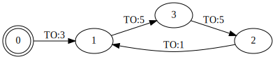

# Spaghetti manual

Homepage: https://github.com/skramm/spaghetti

This page demonstrates usage of the library through several showcases, and gives additional details.
All the example are included an runnable in the src folder, just ```make demo```, then run ```bin/program_name```.

For a reference manual, run ```make doc```, then open
```html/index.html``` (needs doxygen).

1. [Fundamental concepts](#concepts)
1. [Showcase 1: Hello World for FSM](#showcase1)
1. [Showcase 2: let's use a timer](#showcase2)
1. [Showcase 3 : mixing timeout with hardware events](#showcase3)
1. [Additional stuff](#additional_stuff)
   1. [Configuration](#config)
   1. [Checking configuration](#checks)
   1. [FSM getters and other information](#getters)
1. [Build options](#build_options)
1. [FAQ](spaghetti_faq.md)

Before you can get started, all you need is to download and install the file ```spaghetti.hpp``` to a location where your compiler can find it
(On Linux, ```/usr/local/include``` is usually pretty good).
Then you can create a program.

<a name="concepts"></a>
## 1 - Fundamental concepts

Configuration of the state machine is a mix of static and dynamic: the number of states and hardware events is fixed at build time, but it is possible to add transitions at run-time.

States and events are simply defined as enum values:
```C++
enum States { st_1, st_2, st_3, NB_STATES };
enum Events { ev_1, ev_2, ev_3,  NB_EVENTS };
```
Naming is free except for the last value that
**must** be ```NB_STATES``` and ```NB_EVENTS```, respectively.
For the states, the first one (having value 0) will be the initial state.

You can use either classical C++03 enums or C++11 scoped enums (```enum class { st1, st2,...```).
The latter adds of course some type safety.
But all these values are internally casted to integers, so you must not assign values to the enumerators.

Events can be of two types:
- "hardware" events (basically, it can be just a keyboard press): those are the ones you need to define in the enum above.
But you can have none ! Then the above enum will be defined as ```enum Events { NB_EVENTS }```.
- "time out" events, when you want to switch from state A to state B after 'x' seconds. There are handled separately.

For the latter case, you need to provide a special "timing" class, that will have some requirements (see below).
You will need to "assign" the timer to the FSM in the configuration step.
For the other events, it is up to your code to detect these, and then call some Spaghetti member function.

States can be of two types.
Usually, the FSM will switch from one state to another when some transition becomes active.
It can be a Timeout or a hardware event.
But in some situations, you may want an "always active" transition.
Transitions are driven by events, that themselves are handled by user-code.
So obviously, we can't handle "always active" transition that way.
So this library provides a special state status, called "pass-state".
A pass-state will have only **one** transition, that will always be active, which means that once we arrive on such a state, the FSM will immediately switch to the next state.

Limitations: a pass-state cannot lead to another pass-state. However, it can have a associated callback function.


<a name="showcase1"></a>
## 2 - Showcase 1: Hello World for FSM

In this example, we show the "Hello World" of FSM, which is the "Turnstyle" FSM
(see [WP link)](https://en.wikipedia.org/wiki/Finite-state_machine#Example:_coin-operated_turnstile)).

First, create enums for states and events:

```C++
#include "spaghetti.hpp"
enum States { st_Locked, st_Unlocked, NB_STATES };
enum Events { ev_Push, ev_Coin, NB_EVENTS };
```
Then, create the FSM data type:
```C++
SPAG_DECLARE_FSM_TYPE_NOTIMER( fsm_t, States, Events, bool );
```
This means you declare the type ```fsm_t```, using ```States``` and ```Events```, with callback functions having a ```bool``` as argument.
(Alternatively, you could also use a ```typedef```, but lets say this is easier at present.)

Now, you can instanciate the fsm:

```C++
int main()
{
	fsm_t fsm;
```

Next, you need to configure your FSM, that is define what event in what state will trigger switching to what state.
With this simple example, you just do:
```C++
	fsm.assignTransition( st_Locked,   ev_Coin, st_Unlocked );
	fsm.assignTransition( st_Unlocked, ev_Push, st_Locked );
```
This means:
- if a coin is inserted while in "locked" state, then switch to state "unlocked".
- if somebody pushes the gate while in "unlocked" state, then switch to state "locked".

Ok, and also tell the FSM what is to be done when a state gets triggered.
This is done by providing a callback function.
In this case it is the same for all, but you can have a different function for all the states.
You don't even need to provide a callback function, it is always optional:
some states can have one while others won't.
The only constraint is that they must have the same signature.

```C++
	fsm.assignCallback( st_Locked,   cb_func, true );
	fsm.assignCallback( st_Unlocked, cb_func, false );
```

Alternatively (and that is useful if you have a lot of states), you can provide the callback function for all the states, and separately set the argument value:

```C++
	fsm.assignGlobalCallback( cb_func );
	fsm.assignCallbackValue( st_Unlocked, false );
	fsm.assignCallbackValue( st_Locked,   true );
```

And of course you must provide that callback function:

```C++
void cb_func( bool b )
{
	if( b )
		std::cout << "State: Locked\n";
	else
		std::cout << "State: Unlocked\n";
}
```
Done for configuration.
Now, to run this you need to call ```start()```.
(In this simple example, you could avoid this as there are no timeouts involved, but its recommended to do so as it also performs some configuration checks.)

Here the events will be triggered by the keyboard, so lets do this:
```C++
fsm.start();
do
{
	char key;
	std::cout << "Enter command: ";
	std::cin >> key;
	switch( key )
	{
		case 'A':
			std::cout << "Event: push\n";
			fsm.processEvent( ev_Push );
		break;

		case 'B':
			std::cout << "Event: coin\n";
			fsm.processEvent( ev_Coin );
		break;
	}
}
while( 1 );
```

That's it!
All of this is given as a sample program,
see file
[src/turnstyle_1.cpp](https://github.com/skramm/spaghetti/blob/master/src/turnstyle_1.cpp)
and/or just clone repo and enter
```make demo -j4``` followed by ```bin/turnstyle_1```.

<a name="showcase2"></a>
## 3 - Showcase 2: let's use a timer

Lets consider another situation: a traffic light going automatically through the three states: Red, Green, Orange.
You need to provide a Timer class that can be used by the FSM, and that provides **asynchronous** timeouts and
an event waiting loop.
To be usable here, this class needs to provide these three functions:
- ```timerInit()```: initialize the timer
- ```timerStart()```: start a timeout
- ```timerCancel()```: cancel the timer

Any timing class can be used, in the provided sample [```src/traffic_lights_1.cpp```](https://github.com/skramm/spaghetti/blob/master/src/traffic_lights_1.cpp)
 we demonstrate the use of [boost::asio](http://www.boost.org/doc/libs/release/libs/asio/):
```C++
template<typename ST, typename EV, typename CBA>
struct AsioWrapper
{
	boost::asio::io_service io_service;
	std::unique_ptr<boost::asio::deadline_timer> ptimer;

	AsioWrapper()
	{
		ptimer = std::unique_ptr<boost::asio::deadline_timer>( new boost::asio::deadline_timer(io_service) );
	}
...
```
(see full code for details)
The three type parameters are the states, the events, and the type of the argument of the callback function.

Once you have declared this class, the declaration of the data type of the FSM will be done with the second form of the macro:
```C++
SPAG_DECLARE_FSM_TYPE( fsm_t, States, Events, AsioWrapper, bool );
```
The configuration step will go as follows (assuming the states are names st_Red, st_Green, st_Orange).
As you can guess, we have here timeouts of 5, 5, and 1 seconds:

```C++
	fsm.assignTimeOut( st_Red,    5, st_Green  );
	fsm.assignTimeOut( st_Green,  5, st_Orange );
	fsm.assignTimeOut( st_Orange, 1, st_Red   );
```

For the callback, lets say it will just print out the current color, so we can use a string argument:
```C++
void myCallback( std::string v )
{
	std::cout << "color=" << v << '\n';
}
```

And the configuration will include this:
```C++
	fsm.assignGlobalCallback( myCallback );
	fsm.assignCallbackValue( st_Red,    "red" );
	fsm.assignCallbackValue( st_Orange, "Orange" );
	fsm.assignCallbackValue( st_Green,  "Green" );
```

Once configuration is done, you need to instanciate the timer, assign it to the FSM, and start it:
```C++
	AsioWrapper<States,Events,std::string> asio;
	fsm.assignTimer( &asio );
	fsm.start();
```

Done !
Remember: here the ```fsm.start()``` call needs to be the **last** one, as it is now a blocking function.

All of this can be found in the runnable example in
[src/traffic_lights_1.cpp](https://github.com/skramm/spaghetti/blob/master/src/traffic_lights_1.cpp).
This sample has an additional "init state", lasting 3s.
Below is the graph produced by Graphviz from the output generated by ```writeDotFile()``` (see below for details).



<a name="showcase3"></a>
## 4 - Traffic lights with buttons

Now, lets consider the same system but with added buttons to control it.
We add a "Warning" button to make the system enter a "orange blinking state".
Actually, that won't be a unique state, but two different states,
"Blink On" and "Blink Off".

Oh, and also a "Warning off" button (to return to regular cycle), and a "Reset" button (can be useful).

So we have now the following states and events:
```C++
enum EN_States {
	st_Init,
	st_Red,
	st_Orange,
	st_Green,
	st_BlinkOn,
	st_BlinkOff,
	NB_STATES
};
enum EN_Events {
	ev_Reset=0,    ///< reset button
	ev_WarningOn,  ///< blinking mode on
	ev_WarningOff, ///< blinking mode off
	NB_EVENTS
};
```

Configuration of the FSM will be as previously, we just add this (self-explanatory):
```C++
	fsm.assignTimeOut( st_BlinkOn,  1, st_BlinkOff );
	fsm.assignTimeOut( st_BlinkOff, 1, st_BlinkOn );

	fsm.assignTransitionAlways( ev_Reset,     st_Init ); // if reception of message ev_Reset, then switch to state st_Init, whatever the current state is
	fsm.assignTransitionAlways( ev_WarningOn, st_BlinkOn );
	fsm.assignTransition(       st_BlinkOff,  ev_WarningOff, st_Red );
	fsm.assignTransition(       st_BlinkOn,   ev_WarningOff, st_Red );
```

As the ```start()``` member function is blocking, we need to handle the keyboard events in a different thread.
So we define a "user interface" function, templated by the FSM type:

```C++
template<typename FSM>
void UI_thread( const FSM* fsm )
{
	bool quit(false);
	do
	{
		char key;
		std::cin >> key;
		switch( key )
		{
			case 'a': fsm->processEvent( ev_WarningOn );  break;
			case 'b': fsm->processEvent( ev_WarningOff ); break;
			case 'c': fsm->processEvent( ev_Reset );      break;
			case 'q': fsm->stop(); quit = true;           break;
		}
	}
	while( !quit );
}
```

And we start that thread before starting the FSM:
```C++
	std::thread thread_ui( UI_thread<fsm_t>, &fsm );
	fsm.start();  // blocking !
	thread_ui.join();
```

All of this can be found in the runnable example in [src/traffic_lights_2.cpp](https://github.com/skramm/spaghetti/blob/master/src/traffic_lights_2.cpp)
and its companion header file
[src/traffic_lights_common.hpp](
https://github.com/skramm/spaghetti/blob/master/src/traffic_lights_common.hpp).

Once you have tried this, you can also try ```bin/traffic_light_3```.
It is the same but with an added udp network capability:
by running the  program ```bin/traffic_lights_client``` in another shell window
(```bin/traffic_lights_client localhost```) or even on another machine, you can trigger the events using the network.

<a name="additional_stuff"></a>
## 5 - Additional facilities

<a name="config"></a>
### 5.1 - Configuration of the FSM
For FSM configuration, you can proceed as described above but it can be tedious for larger situations.
Instead, you can also assign directly a </b>transition matrix</b>, with the events in lines, the states in columns, and each table cell defining the state
to switch to.
This is done with the member function ```assignTransitionMat()```.

For example, say you have a 3 states (```st0,st1,st2```) and 2 events (```ev1,ev2```)
and you want to switch from each of the states to the next one if the "event 1" occurs, and switch back to initial state if "event 2" occurs.
You can build a "matrix" (vector of vector) holding that information and assign it to the FSM.

```C++
	std::vector<std::vector<En_States>> trMat = {
//           st0 - st1 - st2
/* ev1 */  { st1 , st2 , st0 },
/* ev2 */  { st0 , st0 , st0 }
	};
	fsm.assignTransitionMat( trMat );
```
However, this doesn't take into account the fact that some of the transitions from one state to another may or may not be allowed.
So you also need to provide an **authorization matrix**, that defines what can and what cannot be done.

This is done with the member function ```assignEventMatrix()```.
For example and with the above code, if we want to disable transitionning from state st2 to st0 when event ev2 occurs, it will be this:
```C++
	std::vector<std::vector<En_States>> eventMat = {
//          st0 - st1 - st2
/* ev1 */  { 1 ,   1 ,   1 },
/* ev2 */  { 1 ,   1 ,   0 }
	};
	fsm.assignEventMatrix( eventMat );
```
As you can see, '1' means transition is allowed, '0' means it is disabled.

Of course in such a situation, it would be simpler to use the following two member functions:
```C++
	fsm.allowAllEvents();
	fsm.allowEvent( ev2, st2, false );
```

The first one allows all events for all the states.
The second one disables event ```ev2``` when on state ```st2```.
Please note that this latter function can also be used to **allow** an event, for example one could write:
```fsm.allowEvent( ev2, st2, true )```
or just
```fsm.allowEvent( ev2, st2 )```.

You can also copy all the configuration from one instance of an FSM to another:
```C++
	fsm_t fsm_1, fsm_2;
// configure fsm_1
	...
// copy config of fsm_1 to fsm_2
	fsm_2.assignConfig( fsm_1 );
```
<a name="checks"></a>
### 5.2 - Checking configuration

At startup (when calling ```fsm.start()```), a general checking is done through a call of  ```fsm.doChecking()```.
This is to make sure nothing wrong will happen.
This function can either throw an error in case of an invalid situation, or just print out a warning.

This function is public, so you may call it yourself, in case you need to make sure everything is correct before running.

A warning is issued in the following situations:
- a state is unreachable, that is it is referenced in the states enum but no transitions leads to it.
- a state is a "Dead-end": once in this state, there is no transition leading to another state: the FSM is "stuck".

These latter situations will not disable running the FSM, because they may occur in developement phases, where everything is not finished but the user wants to test things anyway.

<a name="getters"></a>
### 5.3 - FSM getters and other information
Some self-explaining member function that can be useful in user code:

 - ```nbStates()```: returns nb of states
 - ```nbEvents()```: returns nb of events (only "hardware" ones, not timeouts).
 - ```currentState()```: returns current state
 - ```timeOutDuration( EN_States )```: returns duration of timeout

Other stuff:
- Printing the configuration:
The member function ```printConfig()``` will print the current configuration, for example:
```C++
fsm.printConfig( stsd::cout );
```

- Printing runtime data:
If your FSM is able to stop (after a call to ```stop()```), you can printout the runtime data with
```C++
fsm.printLoggedData( std::cout );
```
This will print out, in a CSV style:
 - the state counters (how many of times they were activated)
 - the event counters. This also include the number of timeouts, and the number of "Always Active" transitions that were encountered.
 - a timed log of the transitions from one state to another.

 You can pass to this function a second parameter, to specify **what** data you want:
 - ```PrintFlags::stateCount``` : print state counters
 - ```PrintFlags::eventCount``` : print event counters
 - ```PrintFlags::history``` : print runtime history
 - ```PrintFlags::all```: all of the above (default value)
<br>
These flags can be "OR-ed" to have several ones active.
<br>
Please note that if the symbol ```SPAG_ENUM_STRINGS``` (see below, "Build options") is defined, the strings will appear in this data.
Also see how these functions are used in the provided sample programs.


<a name="build_options"></a>
## 6 - Build options

Several symbols can change the behavior of the library and/or add additional capabilities, you can define them either by adding them in your makefile
(with GCC, its ```-DSPAG_SOME_SYMBOL``` ), or by hardcoding in your program, BEFORE including the library file, like this:

```C++
#define SPAG_SOME_SYMBOL
#include "spaghetti.hpp"
```

They all start with these 5 characters: ```SPAG_```

You can printout at runtime the build options with this static function:
```C++
std::cout << fsm_t::buildOptions()
```
(once you have defined the type ```fsm_t```).

The available options/symbols are:

1 -  ```SPAG_PRINT_STATES``` : will print on stdout the steps, useful only for debugging your SpagFSM

2 -  ```SPAG_ENABLE_LOGGING``` : will enable logging of dynamic data (see spag::SpagFSM::printLoggedData() )

3 -  ```SPAG_FRIENDLY_CHECKING```: A lot of checking is done to ensure no nasty bug will crash your program.
However, in case of incorrect usage of the library by your client code (say, invalid index value),
the default behavior is to spit a standard error message that can be difficult to understand.
So if you define this symbol at build time, instead of getting this:
```
myfile: /usr/local/include/spaghetti.hpp:236: void spag::SpagFSM<STATE, EVENT, TIM>::assignTransitionMat(const std::vector<std::vector<T> >&) [with STATE = SERSTAT; EVENT = EN_EVENTS; TIM = AsioWrapper]: Assertion `mat.size() == EVENT::NB_EVENTS' failed.
Aborted
```
you will get this:
```
Spaghetti: runtime error in func: assignTransitionMat(), values are not equal:
 - mat.size() value=7
 - EVENT::NB_EVENTS value=8
Exiting...
```
If this symbol is not defined, regular checking is done with the classical ```assert()```.
As usual, this checking can be removed by defining the symbol ```NDEBUG```.

4 - ```SPAG_ENUM_STRINGS``` : this enables the usage of enum-string mapping, for states and events.
You can provide a string either individually with
```C++
	fsm.assignString2Event( ev_MyEvent, "something happened" );
	fsm.assignString2State( st_Arizona, "Arizona state" );
```
or globally, by providing a vector of pairs(enum values, string). For example:
```C++
	std::vector<std::pair<EVENT,std::string>> v_str = {
		{ ev_Reset,      "Reset" },
		{ ev_WarningOn,  "Warning On" },
		{ ev_WarningOff, "Warning Off" }
	};
	fsm.assignStrings2Events( v_str );
```
(and similarly with ```assignStrings2States()``` for states.)
<br>
These strings will then be printed out when calling the ```printConfig()``` and ```printData()``` member function.
<br>
Default values are also generated when this option is enabled, in the form "St-x" and "Ev-x".

5 - ```SPAG_EXTERNAL_EVENT_LOOP``` : this is needed if you intend to run several FSM concurrently.
In that case, the Timer class must not hold the timer.
If it does, then starting the FSM (```fsm.start()```) will be a blocking function, thus is would not be possible to start a second FSM.
So you need to provide the event loop separately and define this symbol.
The changes is that now the start function will not be blocking:
you can start all the needed FSM, then eventually start the event loop.
This is demonstrated in sample program [src/sample_2.cpp](../../../tree/master/src/sample_2.cpp).

6 - ```SPAG_GENERATE_DOTFILE``` : this enables the member function ```writeDotFile( std::string )```.
When called, it will generate in current folder a .dot file of the current configuration that can be used to produce an image of the corresponding graph, using the well-know tool Graphviz.
For example, with
```
$ dot -Tsvg inputfile.dot >outputfile.svg
```

--- Copyright S. Kramm - 2018 ---
